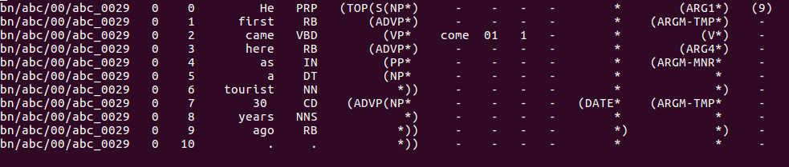
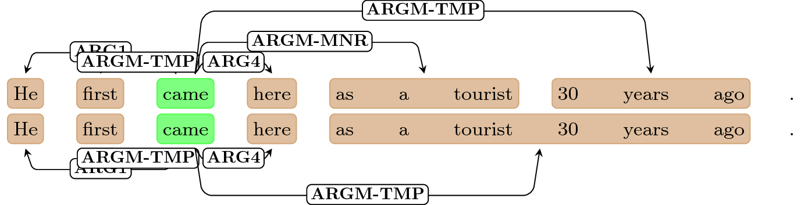

# srl2tex
## Creates LaTeX source from semantic role annotations

The plain semantic-role annotated files are difficult to read and interpret:
 


 This simple tool lets you visualize the predicate-argument structure. It marks the predicate and its arguments, and connects them with labeled edges. It outputs a LaTeX file (relying on TikZ-dependency) that can be compiled to PDF.

## Obtaining srl2tex

A prebuilt version of srl2tex is available as a [release](https://github.com/clips/srl2tex/releases/latest).

## Building srl2tex

The project can be built with sbt. Run `sbt assembly` to create a fat jar in `target/scala-2.11/`.

## Running srl2tex <a name="run"></a>

```
java -jar srl2tex.jar FILE_PREDICTIONS FILE_GOLD
```

The goal of the current implementation is to be able to visualize gold and predicted structures, one above the other for easier comparison.

## Example run

```
java -jar srl2tex.jar src/main/resources/sample_predicted src/main/resources/sample_gold
```

This will produce `output.tex` which can be compiled with `pdflatex` to give the following result (only the first sentence shown):
 

 
 Although some tweaking of TikZ spacing parameters is performed internally, it might still be necessary to adjust the spacing and similar manually for the optimal result.

(c) Simon Šuster, 2016
